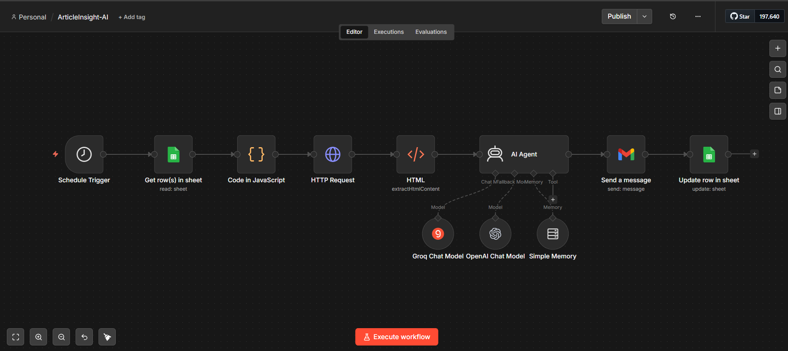
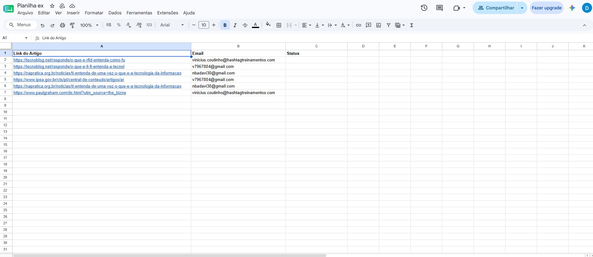
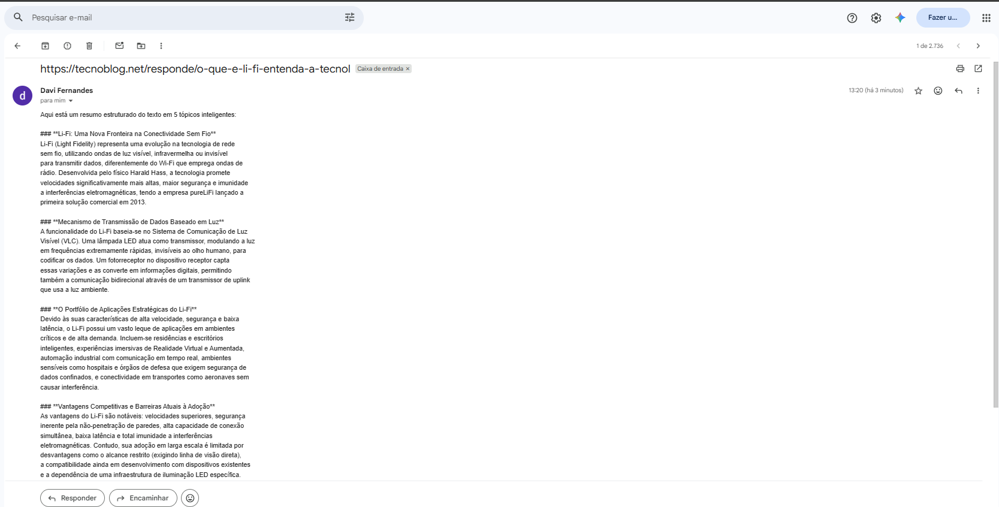
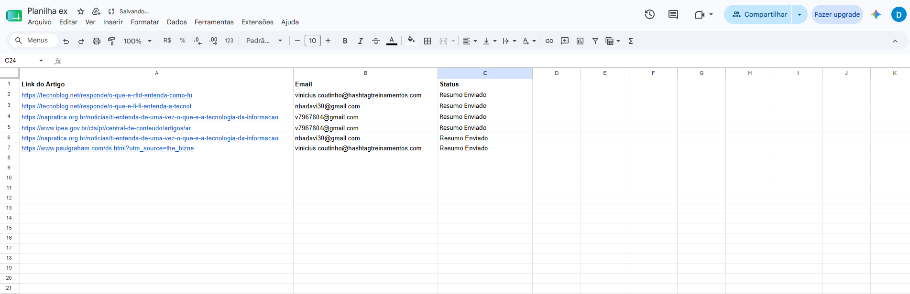

# 📄 Resumo Automático de Artigos com IA (n8n)

Automação que monitora uma planilha do Google Sheets com links de artigos, extrai o conteúdo de cada página, gera um resumo com IA (Google Gemini) e envia por e-mail — atualizando o status na planilha ao final de cada execução.






---

## 🎬 Demonstração


---

## 🎯 Objetivo

Muitas vezes recebemos ou salvamos links de artigos interessantes, mas não temos tempo de ler tudo. Esse workflow resolve isso automaticamente:

1. Lê uma lista de artigos (link + e-mail do destinatário) de uma planilha do Google Sheets
2. Identifica quais ainda **não foram processados**
3. Extrai o conteúdo do artigo
4. Gera um resumo com IA
5. Envia o resumo por e-mail
6. Marca a linha como processada na planilha

Tudo isso rodando de forma agendada, sem intervenção manual.

---

## 🔧 Como funciona (arquitetura)

```
Schedule Trigger
      │
      ▼
Get row(s) in sheet  →  lê todas as linhas da planilha
      │
      ▼
If (Status vazio?)  →  filtra apenas artigos pendentes
      │
      ├── false → No Operation (nada a fazer)
      │
      └── true  →
             │
             ▼
        HTTP Request (Jina AI Reader)  →  extrai o conteúdo da página em Markdown
             │
             ▼
        HTML (Extract HTML Content)  →  normaliza o texto extraído
             │
             ▼
        Message a model (Google Gemini)  →  gera o resumo do artigo
             │
             ▼
        Send a message (Gmail)  →  envia o resumo por e-mail
             │
             ▼
        Update row in sheet  →  marca a linha como "Resumo Enviado"
```

---

## 🧩 Nodes utilizados

| Node                           | Função                                                                                                |
| ------------------------------ | ----------------------------------------------------------------------------------------------------- |
| **Schedule Trigger**           | Dispara o workflow em intervalos definidos                                                            |
| **Google Sheets – Get Row(s)** | Lê os artigos cadastrados na planilha                                                                 |
| **If**                         | Filtra apenas linhas com status pendente                                                              |
| **HTTP Request**               | Usa o [Jina AI Reader](https://jina.ai/reader) para extrair o conteúdo de qualquer URL em texto limpo |
| **HTML**                       | Processa/normaliza o conteúdo extraído                                                                |
| **Message a Model (Gemini)**   | Gera o resumo do artigo via IA                                                                        |
| **Gmail – Send a Message**     | Envia o resumo para o e-mail cadastrado                                                               |
| **Google Sheets – Update Row** | Atualiza o status da linha processada                                                                 |
| **No Operation**               | Encerra o fluxo quando não há artigos pendentes                                                       |

---

## 📊 Planilha (estrutura esperada)

| Link do Artigo               | Email             | Status         |
| ---------------------------- | ----------------- | -------------- |
| https://exemplo.com/artigo-1 | usuario@email.com | _(vazio)_      |
| https://exemplo.com/artigo-2 | usuario@email.com | Resumo Enviado |

- **Link do Artigo**: URL do conteúdo a ser resumido
- **Email**: destinatário do resumo
- **Status**: controla o que já foi processado (evita duplicidade e reprocessamento)

---

## ⚙️ Configuração e credenciais necessárias

Para rodar este workflow você precisa configurar no n8n:

1. **Google Sheets OAuth2** — acesso de leitura/escrita à planilha
2. **Gmail OAuth2** — envio de e-mails
3. **Google Gemini API Key** — geração dos resumos
4. Nenhuma chave é necessária para o Jina AI Reader em uso básico, mas recomenda-se uma **API Key gratuita** (evita bloqueios de reputação de IP em ambientes cloud)

> ⚠️ O arquivo `workflow.json` deste repositório está anonimizado — não contém credenciais, tokens ou IDs reais de planilha.

---

## 🚀 Como importar e usar

1. Abra o n8n
2. Vá em **Workflows → Import from File**
3. Selecione o `workflow.json` deste repositório
4. Configure suas credenciais (Google Sheets, Gmail, Gemini)
5. Substitua o ID da planilha pelo seu próprio (`Document → By URL`)
6. Ative o workflow

---

## 🛠️ Desafios técnicos resolvidos

Durante o desenvolvimento, alguns problemas reais foram identificados e corrigidos:

- **Match incorreto de linhas**: o node de atualização usava apenas o e-mail como chave, causando atualização de múltiplas linhas com o mesmo destinatário. Resolvido usando `row_number` como identificador único.
- **Bloqueio de IP por reputação de rede (Jina AI Reader)**: chamadas anônimas de IPs de datacenter eram bloqueadas; resolvido com autenticação via API Key.
- **Processamento em lote indesejado**: o fluxo processava todos os artigos pendentes de uma vez, em vez de um por execução — ajustado o filtro de itens processados por ciclo.

---

## 💡 Possíveis melhorias futuras

- Adicionar tratamento de erro (retry) para falhas de extração de conteúdo
- Suporte a múltiplos idiomas no resumo
- Dashboard simples para acompanhar o histórico de artigos processados

---

## 🧑‍💻 Autor

Desenvolvido por **Davi** como parte de um projeto de estudo em automação de fluxos de trabalho com **n8n** e integração com **modelos de IA**.
